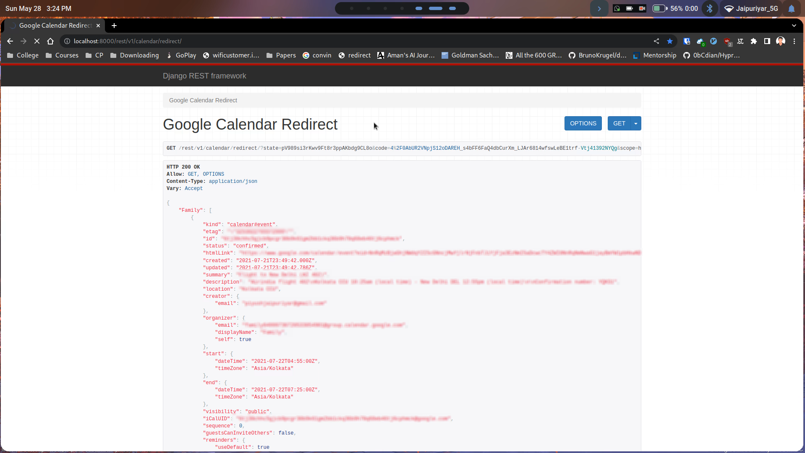

# Django REST API for Google Calendar Integration
This repository contains a Django REST API for integrating with Google Calendar. The API provides two endpoints for initializing the Google authentication process and handling the authentication redirect.

It has been deployed at [replit](https://replit.com/@ayushjaipuriyar/convin-assessment-1)
## Endpoints
---
* **`/rest/v1/calendar/init/`**:  Initializes the Google authentication and provides the authentication URL for OAuth2. Once authenticated, it redirects to the next endpoint `/rest/v1/calendar/redirect/`.
* **`/rest/v1/calendar/redirect/`**: Handles the authentication redirect from Google. Retrieves the user's credentials and uses them to access the Google Calendar API. Returns a response containing the user's calendar events.

## Prerequisites
---
Before running the API, make sure you have the following prerequisites:
``` 
google-auth = "==1.8.0"
google-auth-oauthlib = "==0.4.1"
google-auth-httplib2 = "==0.0.3"
google-api-python-client = "==1.7.2"
django-cors-headers = "*"
django-sslserver = "*"
djangorestframework = "*"
pipenv
```
## Installation
---

1. Clone the repository:

```bash
git clone https://github.com/ayushjaipuriyar/convin-assessment.git
cd convin-assessment
```

2. Install the dependencies:

```bash
pipenv shell
pipenv install
```
3. Configure Google OAuth2:
```
Obtain the client secret JSON file from the Google Developer Console.
Rename the client secret JSON file to google_oauth_client_secret.json.
Replace settings.GOOGLE_OAUTH_CLIENT_SECRET in GoogleCalendarInitView and GoogleCalendarRedirectView with the path to your google_oauth_client_secret.json file.
```
4. Apply database migrations:

```bash
python manage.py makemigrations
python manage.py mmigrate
```
5. Start the development server:

```bash
python manage.py runsslserver
```
The API will be accessible at http://localhost:8000/.

## Usage
---
You can interact with the API using your preferred REST client (e.g., cURL, Postman). Here's an example workflow:

But this has api has djangorestframework which allows us to see the results in the preffered web choice

Initialize Google authentication by making a GET request to /rest/v1/calendar/init/. This endpoint will return a response containing the authorization URL.

Redirect the user to the obtained authorization URL. After authentication, the user will be redirected to /rest/v1/calendar/redirect/.

Make a GET request to /rest/v1/calendar/redirect/ to retrieve the user's calendar events. The API will handle the authentication and return a response containing the calendar events.

## Code Explanation
---
The code contains two functions, GoogleCalendarInitView and GoogleCalendarRedirectView, which correspond to the two API endpoints.

* **GoogleCalendarInitView**: Initializes the Google authentication process. If the user's credentials are already stored in the session, it redirects to the redirect endpoint. Otherwise, it generates the authorization URL and stores the state parameter in the session.

* **GoogleCalendarRedirectView**: Handles the authentication redirect from Google. It retrieves the user's credentials, validates them, and uses them to access the Google Calendar API. It then retrieves the user's calendar events and returns them in the response.

## Working

https://github.com/ayushjaipuriyar/convin-assessment/assets/66643292/554dcbf9-374e-4df7-a465-c81dbacd9846

